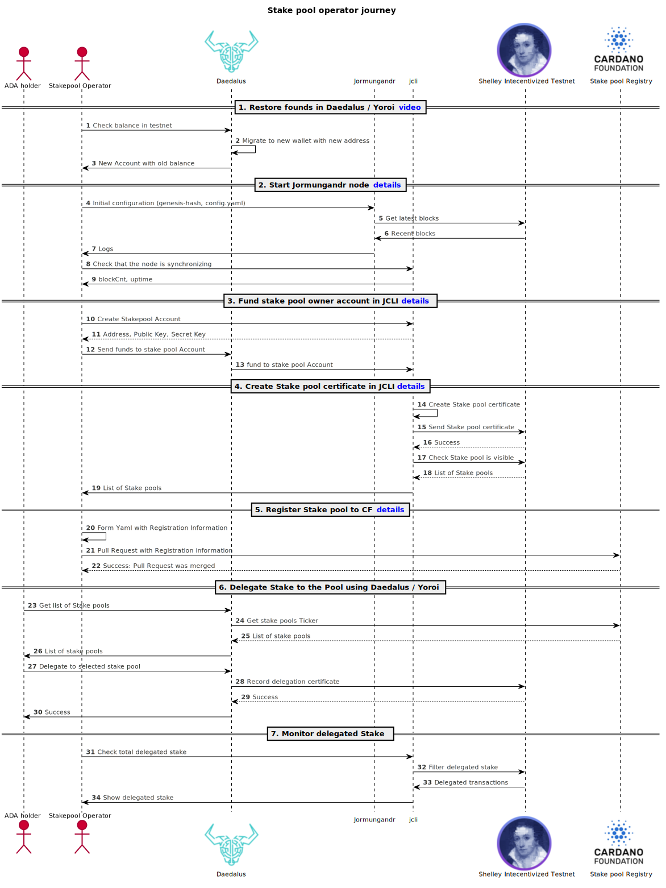

- [Stake pool operator How-To](#stake-pool-operator-journey)
- [1. Understand stake pool minimal system requirements](#understand-stake-pool-minimal-system-requirements)
  - [1.1 Hardware](#hardware)
  - [1.2 Operating System](#operating-system)
  - [1.3 Software (Jormungandr)](#software-jormungandr)
- [2. Start Jormungandr node](#start-jormungandr-node)
  - [2.1 Find the latest version of the testnet](#org0274ba6)
  - [2.2 Download Jormungandr from GitHub](#download-jormungandr-from-github)
  - [2.3 Extract the files (in your Terminal or Finder)](#extract-the-files-either-use-terminal-or-finder)
  - [2.4 Verify the files were installed correctly](#verify-the-files-were-installed-correctly)
  - [2.5 Configure your node](#configure-your-node)
    - [2.5.1 Download the config.yaml file](#download-the-config.yaml-file)
    - [2.5.2 Add stake pool configuration parameters](#org52c1f99)
    - [2.5.3 Create the genesis-hash.txt file](#download-the-genesis-hash.txt-file)
  - [2.6 Start the node](#start-the-node)
  - [2.7 Check that the node is syncing](#check-that-the-node-syncing)
- [3. Fund stake pool owner account in JCLI](#fund-stake-pool-owner-account-in-jcli)
  - [3.1 Create an account address using the script](#create-an-account-address-using-the-script)
  - [3.2 Send funds to your stake pool account](#send-funds-to-your-stake-pool-account)
    - [3.2.1 For The Nightly Testnet](#orgab1fc5a)
    - [3.2.2 For the Incentivized Testnet using Cardano-Wallet CLI](#org81d85c3)
    - [3.2.3 For the Incentivized Testnet using Daedalus](#org1027a29)
  - [3.3 Check balance in your stake pool account](#orga5534d3)
- [4. Create a stake pool certificate in JCLI](#create-a-stake-pool-certificate-in-jcli)
  - [4.1 Download the createStakePool and send-certificate scripts](#create-a-stake-pool-using-a-script)
  - [4.2 Check the parameters required by the script](#org77ebb36)
  - [4.3 Execute the `createStakePool.sh` script](#org255bcb3)
  - [4.4 Check that the stake pool is in the  blockchain.](#org54d3dcc)
  - [4.2 Restart Jormungandr as a stake pool](#orgcfe6b9e)
- [5. Register stake pool to the Cardano Foundation](#orgb95f152)
  - [5.1 Fork and clone the Cardano Foundation Registry repository.](#org2691c84)
  - [5.2 Create stake pool JSON file](#org3699c16)
  - [5.3 Sign with your owner Private Key](#orgc82992b)
  - [5.4 Verify that we have the correct files.](#org7227847)
  - [5.5 Commit files](#orgba5b27f)
  - [5.6 Create Pull Request](#org83e6d6b)
  - [5.7 Check that the stake pool appears in the Daedalus wallet.](#orgc5fddb8)
- [6. Delegate your stake to your stake pool](#org4ce4119)
  - [6.1 Download the delegate-account script](#orgca7fe53)
  - [6.2 Check the parameters required by the script](#org7e4fc27)
  - [6.3 Execute the script](#org17b2479)
  - [6.4 Check that your stake was delegated](#org2bc69fd)
- [7. Monitor Delegated Stake](#org35b9919)
  - [7.1 Check delegated stake through JCLI](#orgccfdd79)


<a id="stake-pool-operator-journey"></a>

# Stake pool operator How-To

A Stake pool operator plays a fundamental role in the health and decentralization of the Cardano Blockchain. In the following sections we are going to see **How to become a stake pool operator**.

Keep in mind the following diagram as we go along the process to create a stale pool




<a id="understand-stake-pool-minimal-system-requirements"></a>

# 1. Understand stake pool minimal system requirements

There are hardware, operating system and software requirements to set up a stake pool.


<a id="hardware"></a>

## 1.1 Hardware

-   4 GB of RAM
-   A Good network connection and about 1 GB of \* bandwidth / hour
-   A public ip4 address
-   Processor speed is not a significant factor


<a id="operating-system"></a>

## 1.2 Operating System

Supported stake pool operating systems

We support Linux, BSD, Mac, and Windows platforms. The following versions are required:

-   Linux (2.6.18 or later)
-   BSD (Net BSD 8.x and Free BSD 12.x)
-   mac OS (10.7 Lion or later)
-   Windows 10


<a id="software-jormungandr"></a>

## 1.3 Software (Jormungandr)

Latest version of Jormungandr and JCLI. Just follow along in the next section. Or check the [repository](https://github.com/input-output-hk/jormungandr/releases).


<a id="start-jormungandr-node"></a>

# 2. Start Jormungandr node

First let's download, configure and start the Jormungandr node. Note: If you have any issues while installing Jormungandr and JCLI, please refer to our support portal [macOS/Linux instructions](https://iohk.zendesk.com/hc/en-us/articles/360036898153).


<a id="org0274ba6"></a>

## 2.1 Find the latest version of the testnet

You can find the configuration parameters [here](https://hydra.iohk.io/job/Cardano/iohk-nix/jormungandr-deployment/latest-finished/download/1/index.html) Select the one for Incentivized testnet and download the appropriate version of Jormungandr from GitHub.


<a id="download-jormungandr-from-github"></a>

## 2.2 Download Jormungandr from GitHub

On [github.com/input-output-hk/jormungandr/](https://github.com/input-output-hk/jormungandr/releases/) go to `Releases` and from there download the appropriate file for your operating system.

-   For Linux download the file ending in `...-x86_64-unknown-linux-gnu.tar.gz`
-   For MacOS download the file ending in `...-x86_64-apple-darwin.tar.gz`


<a id="extract-the-files-either-use-terminal-or-finder"></a>

## 2.3 Extract the files (in your Terminal or Finder)

-   Using the command line: in terminal, navigate to the directory where you downloaded the file and execute the following command to uncompress it:

```sh
tar -xzvf jormungandr-v0.8.0-x86_64-unknown-linux-gnu.tar.gz
```

OR

-   In Finder: navigate to the folder where you saved the files (the default is the Downloads folder), Double-click the file to extract it. This will create a folder with the same name as the file, the folder will contain two files in it.


<a id="verify-the-files-were-installed-correctly"></a>

## 2.4 Verify the files were installed correctly

In Terminal just type

```sh
./jcli -V
```

It returns the version of JCLI

```sh
$ jcli 0.8.0
```

Victory! JCLI is available to us.


<a id="configure-your-node"></a>

## 2.5 Configure your node


<a id="download-the-config.yaml-file"></a>

### 2.5.1 Download the config.yaml file

From the [Jormungandr Configurations page](https://hydra.iohk.io/job/Cardano/iohk-nix/jormungandr-deployment/latest-finished/download/1/index.html), save the config.yaml. We will use this file to start Jormungandr, among other things it has the list of trusted peers from which we are going to download our own copy of the blockchain.


<a id="org52c1f99"></a>

### 2.5.2 Add stake pool configuration parameters

Since we are setting up a stake pool we need to add our public IP, listen address and the storage location to the configuration file.

for example:

```sh
cat ./templates/stakepool_config_addenda.json | sed 's/187.133.2.28/0.0.0.0/g'
```

```sh
{
    "log": [
	{
	    "format": "plain",
	    "level": "info",
	    "output": "stderr"
	}
    ],
    "storage": "./storage/",
    "p2p": {
	"listen_address": "/ip4/0.0.0.0/tcp/3000",
	"public_address": "/ip4/0.0.0.0/tcp/3000",
	"topics_of_interest": {
	    "blocks": "high",
	    "messages": "high"
	},
```


<a id="download-the-genesis-hash.txt-file"></a>

### 2.5.3 Create the genesis-hash.txt file

From [Jormungandr Configurations page](https://hydra.iohk.io/job/Cardano/iohk-nix/jormungandr-deployment/latest-finished/download/1/index.html), copy the genesis hash and save it to a file called `genesis-hash.txt`

Once you have created the genesis-hash.txt file, check its contents to make sure it matches the one dispalyed in Jormungandr Configurations page.

```sh
cat genesis-hash.txt
```


<a id="start-the-node"></a>

## 2.6 Start the node

Run the following command in the same location where all 3 files were saved.

```sh
./jormungandr --genesis-block-hash $(cat genesis-hash.txt) --config ./stakepool-config.yaml
```


<a id="check-that-the-node-syncing"></a>

## 2.7 Check that the node is syncing

Execute the following command in your command-line interface to check if your node is syncing.

```sh
./jcli rest v0 node stats get --host "http://127.0.0.1:3100/api"
```

In the output, \`blockRecvCnt\` tells how many blocks have been downloaded:

```yaml
---
blockRecvCnt: 2
lastBlockDate: "0.6056"
lastBlockFees: 4
lastBlockHash: 29f83b496e53073221d26cd5f09050d819069a699c30600f9afbf41170236b7a
lastBlockHeight: "482"
lastBlockSum: 10000000004
lastBlockTime: "2019-12-04T15:57:20+00:00"
lastBlockTx: 1
state: Running
txRecvCnt: 1
uptime: 46
version: jormungandr 0.8.0-rc7-ab32b2c
```

Your node is synced with the blockchain when it receives all the blocks that are created in the network in real-time. You can check that by following the below 2 rules:

1.  Execute the `node stats` command from above multiple times and check that the value of the lastBlockHash field is updated (with the actual blockchain values, there should be a new block created every 2-5 minutes);
2.  Compare the value of the lastBlockTime field (that is in UTC) with the local time of the node. If the difference if more than 10 minutes, the node might not be `synced` even the node received blocks in the past (blockRecvCnt > 0);


<a id="fund-stake-pool-owner-account-in-jcli"></a>

# 3. Fund stake pool owner account in JCLI

To register a stake pool in the blockchain, we need to create a stake pool certificate and send it to the blockchain. This requires us to have enough funds to pay for the transaction fee. Note: Step 3.2 will change once the Incentivized testent is launched.


<a id="create-an-account-address-using-the-script"></a>

## 3.1 Create an account address using the script

Run the following command to download the `createAddress.sh` script in the same location:

```sh
curl -sLOJ https://raw.githubusercontent.com/input-output-hk/jormungandr-qa/master/scripts/createAddress.sh
```

Make the script executable:

```sh
chmod +x createAddress.sh
```

-   Create a new account address.

```sh
./createAddress.sh account | tee stakepool_owner_account.txt
```

The script returns your cryptographic keys and an address of type account. We are saving them in the file stakepool<sub>owner</sub><sub>account.txt</sub> **IT IS EXTREMELY IMPORTANT THAT YOU SAVE YOUR KEYS FOR FUTURE USE**

```sh
PRIVATE_KEY_SK: ed25519e_sk1lq2zcyms6exxan0xx2gufjt2hdgsxmytgv5fl7nd4agzc89e6eympdwrhc2e59zkhqrpp3gnc4cfp5kf9xqufr9kn7ddl5uvtdsr84q5rg3ge
PUBLIC_KEY_PK:  ed25519_pk1nm8frtnm8r8yf7tn920akuhtw5s2xaug4mepk84kn3l9znansh0qn206ej
ADDRESS:        addr1sk0vaydw0vuvu38ewv4flkmjad6jpgmh3zh0yxc7k6w8u520kwzaus7z93h
```


<a id="send-funds-to-your-stake-pool-account"></a>

## 3.2 Send funds to your stake pool account

Depending on when you are reading this How-to, you will have three options to finance your account.

1.  Using the Faucet in the legacy testnet with test tokens.
2.  Using the Cardano-Wallet with command line.
3.  Using Daedalus.


<a id="orgab1fc5a"></a>

### 3.2.1 For The Nightly Testnet

Funding your account for the Nightly testnet is simple, it has a Faucet that disperses test tokens so that you can practice and experiment with them.

```sh
curl -X POST https://faucet.legacy.jormungandr-testnet.iohkdev.io/send-money/$ACCOUNT_ADDRESS
```

```js
{"success":true,"amount":10000000000,"fee":4,"txid":"cc8953e38d2df5159158c80fd8fdc869a2724a99adff279fb51d413a76fd964e"}
```


<a id="org81d85c3"></a>

### 3.2.2 For the Incentivized Testnet using Cardano-Wallet CLI

The autorative source for funding in the Incentivized testnet is this article: [How to Register Your Stake Pool](https://github.com/cardano-foundation/incentivized-testnet-stakepool-registry/wiki/How-to-Register-Your-Stake-Pool#step-3-fund-your-account) follow the tutorial along and come back, once you have sent yourself some funds.


<a id="org1027a29"></a>

### 3.2.3 For the Incentivized Testnet using Daedalus

With the Daedalus version for the Incentivized testnet you will be able to finance your account directly from your wallet sending funds to your `$ACCOUNT_ADDRESS`.


<a id="orga5534d3"></a>

## 3.3 Check balance in your stake pool account

```sh
./jcli rest v0 account get $ACCOUNT_ADDRESS -h http://127.0.0.1:3100/api
```


<a id="create-a-stake-pool-certificate-in-jcli"></a>

# 4. Create a stake pool certificate in JCLI


<a id="create-a-stake-pool-using-a-script"></a>

## 4.1 Download the createStakePool and send-certificate scripts

-   Download the `createStakePool.sh` script from the [repository](https://github.com/input-output-hk/jormungandr-qa/tree/master/scripts) and save it to the directory where you stored the rest of the files (jcli, Jormungandr, config.yaml, etc). You can download the script using your browser or the following commands:

-   Open the terminal in the location where you have the rest of the files (jcli, Jormungandr, config.yaml, etc) and run the below commands to download the `createStakePool.sh` and `send-certificate.sh` scripts into that location:

```sh
curl -sLOJ https://raw.githubusercontent.com/input-output-hk/jormungandr-qa/master/scripts/createStakePool.sh
curl -sLOJ https://raw.githubusercontent.com/input-output-hk/jormungandr-qa/master/scripts/send-certificate.sh
```

Check that the scripts were downloaded into the current location by executing `ls` command into the terminal

-   Change the scripts permissions to be able to execute them

```sh
chmod +x createStakePool.sh
chmod +x send-certificate.sh
```


<a id="org77ebb36"></a>

## 4.2 Check the parameters required by the script

```sh
./createStakePool.sh --help
```

Output:

```sh
<TAX_VALUE> <TAX_RATIO> <TAX_LIMIT> <ACCOUNT_SK>
The REST Listen Port set in node-config.yaml file (EX: 3101)
The fixed cut the stake pool will take from the total reward
The percentage of the remaining value that will be taken from the total
A value that can be set to limit the pool's Tax.
The Secret key of the Source address
```

For a detailed explanation of the TAX<sub>VALUE</sub>, TAX<sub>RATIO</sub> and TAX<sub>LIMIT</sub> parameters. check this [article](https://input-output-hk.github.io/jormungandr/stake_pool/registering_stake_pool.html). Remember the quantities are in **Lovelaces** i.e. 1 ADA = 1,000,000 Lovelace.


<a id="org255bcb3"></a>

## 4.3 Execute the `createStakePool.sh` script

In this example the Secret Key is:

```sh
echo $PRIVATE_KEY_SK
```

```sh
$ ed25519e_sk1lq2zcyms6exxan0xx2gufjt2hdgsxmytgv5fl7nd4agzc89e6eympdwrhc2e59zkhqrpp3gnc4cfp5kf9xqufr9kn7ddl5uvtdsr84q5rg3ge
```

Call the `createStakePool.sh` script with our secret key and save the output to the `createStakePool_output.txt` file

```sh
./createStakePool.sh 3100 10000 1/10 1000000 $PRIVATE_KEY_SK | tee createStakePool_output.txt
```

That command returns the following output. Pay attention to your node-id and the `node_secret.yaml` file.

```sh
+ + ./createStakePool.sh 3100 10000 1/10 1000000 ed25519e_sk1lq2zcyms6exxan0xx2gufjt2hdgsxmytgv5fl7nd4agzc89e6eympdwrhc2e59zkhqrpp3gnc4cfp5kf9xqufr9kn7ddl5uvtdsr84q5rg3ge
tee createStakePool_output.txt
================ Blockchain details =================
REST_PORT:        3100
ACCOUNT_SK:       ed25519e_sk1lq2zcyms6exxan0xx2gufjt2hdgsxmytgv5fl7nd4agzc89e6eympdwrhc2e59zkhqrpp3gnc4cfp5kf9xqufr9kn7ddl5uvtdsr84q5rg3ge
BLOCK0_HASH:      c8a1b4b8cd3b6a6c39adba11f62c34230b37b388f5a8edfe8cd73e7b8f811f48
FEE_CONSTANT:     2
FEE_COEFFICIENT:  1
FEE_CERTIFICATE:  4
==================================================
#1. Create VRF keys
POOL_VRF_SK: vrf_sk15kyr7422z69urytz0j5yx8e0shdsg9hqsqe3cjw289xhkdhdfc9ssr2hdq
POOL_VRF_PK: vrf_pk1g3ac9l7fg27au7zxwc4tyj2pua35tfvrguwf0hg203rez3jffgvsqmtp57
#2. Create KES keys
POOL_KES_SK: kes25519-12-sk1qqqqqq9hcm2aqrhx024uxd748jkrs687qesd945guja5lzqlx36k74yn0g3mgtdevyqzla895ylcdlp8rcq7vqepp6nnpegyunvtupjs6qlyax2lxr8rdzkk846546jkahc5fj63yzhh9fx7ev3cg7x267fms0zdhxeeavzphdhf3cj8cnw9395xf7rufdkge2c033k32rf3q52sd3allhpmqzxrxgy9226236yhesals88l4wl3yupddxa5575cauz0pe2fwe56uhua4t77a8dajgnnmdf997dugx4wk523z3nqskxchp9dyguccwush6pqfax57dr7gj7zcjcrtmfugny3tzc6cyzkyy4wfe3fht6sf2tzy2v5f3kya6jehnz2lv6uqzd8jv7vr35l95g79rjcfrlc9xqrz8q7h2n6hl8lwhv0gdqjuctw40rrakjuhwgd0r2w7t5vwvvvkuuzxf9jq68a0u8kjxp4seeczlp7fmar4e9jc9pvn5hhc30knhfh0jnzckexlh9an053508x9m6qvt37ra4ls8h43req6lu2d8xgv9sptkf9syafvyhqkumqwpx28xng4s9uymv3tk82hhhrxh3kftxqghjt9874ry855axxsacnqxmzh9xxmkxgc5q2l9dgpdhrvdtdk9nhv32ct3yuaw432l5z4e9uct87l294qjnjgz40xk0vczffwqeu8x2l37k6kzjv8daee3hy2kv5f6fkxpd3npj3hmdhvr4d90sstm7v0rr6e5egtdmgd5w6s4n6ntzf7z0qmskrvs2drvejl0hdg7vt76a2a6frf7z3jnfze0d4402x437xa4whu8s4nmxpf5a67a96qvjawphntw6rpp48pzm08a0kr0ka5480w8jfjnlm55xuk06e5fudyq4dgj73kdphz9ssay4whtxssfc7wrwx33dudpddjlsvz6qphsttudlphsyteu5p6djuwt6mpdk27pfnpgftn2lnvnnpx952rz6rywhlqzwvecgud0sf3g059xqhfwn34acjhr5kzrqda3sj9wqp8kl9rts2a66ljecjfhay83l3qzgwscpy67wzcjn4pgq26ljhczkzg9y5lhgj75fa06wv09xmvrk6t4j2l8mrxwga7ksnsc55tl7qc3rhxwnxj4a070qu8g87xchcyuxp570zwjcw08auhy2tumsmmzh0rhrru8sngsd67mmz8dpdh9ssqtl5uksnlphuyu0qresryy82wv89qnjd30sx2rgrunjf7q4krr8c4ze5enlsq42rx9safl66wsknr8d8f7v09qr03lakkc6awayy9qmruu0l6u97hvgnz7slff9hrj9xu4atghjmc5d4wmznyeyq2th2ddwrmgercgjpl50f7qstg3kjlj3t402tp5pnesvjlg4zduvux3ev6sm5ja5j4uyum825pxz6jyeaqphpzggzef30tkxcvejnv5vk49qz7q429lwe45uhrn2d69hj64lq59hcd7dtds8nleshfqtxyw4mpvddjdsfu2c9448l688uq2xy7twsu8cnylv43jvh92fv2re9rrn9rz7jz04chms0x7zxcj8l7kdulxvvvjn4e70cmfnwn27jvw3a73t5y25uwpul9ygr9w76vhc8ptwz554sguc6mdmupp37r3fe8dyhmt99jqcv3kr0z99c6w230q377fxqfzj6alsv0dsmn039usva84z2vs4ajmjvpreue3qxs6vqxc5tqchu74l4fndcp27adeah2tku6excg6skhuwam4vy0y62mpa09ukk7rr3mdaxt9uw9zv7p2an7j0074hw5wvf2fx9cm2rn8yzvzfjmwqwc2u3t37smpwthqz8dyeukl5gmnyt5avy25elwzuwf838ce70rju477ycv2dxc4psv5uncjdz9ttyzp
POOL_KES_PK: kes25519-12-pk1lp3ta4aphvpct84cykhq37cd9vh9005y02gxhrnd0djdcns6up2sjgn884
#3. Create the Stake Pool certificate using above VRF and KEY public keys
 Sign the Stake Pool certificate
SIGNED_STAKE_POOL_CERTIFICATE: signedcert1qvqqqqqqqqqqqqqqqqqqqqqqqqqqqqqqqqqqqqqqqqqqqqqqqqqqz3rmstlujs4ameuyva32kfy5remrgkjcx3cujlws5lz8j9ryjjselp3ta4aphvpct84cykhq37cd9vh9005y02gxhrnd0djdcns6up2sr8kwjxh8kwxwgnuhx25lmdewkafq5dmc3thjrv0td8r7298m8pw7qqqqqqqqqqqzwyqqqqqqqqqqqqqsqqqqqqqqqqq2qqqqqqqqpapyqqqpqq23upxuk26389w6579x6988j6d6chsz2xvzptcelcsgnepyte4nf0rpln9j4vp70gs0z2kqysht2ztm06zrx2s473kjjc8a8m2024grxeq4sp
#4. Send the signed Stake Pool certificate to the blockchain
===============Send Certificate=================
CERTIFICATE_PATH: stake_pool.cert
REST_PORT: 3100
ACCOUNT_SK: ed25519e_sk1lq2zcyms6exxan0xx2gufjt2hdgsxmytgv5fl7nd4agzc89e6eympdwrhc2e59zkhqrpp3gnc4cfp5kf9xqufr9kn7ddl5uvtdsr84q5rg3ge
BLOCK0_HASH: c8a1b4b8cd3b6a6c39adba11f62c34230b37b388f5a8edfe8cd73e7b8f811f48
FEE_CONSTANT: 2
FEE_COEFFICIENT: 1
FEE_CERTIFICATE: 4
==================================================
#1. Create the offline transaction file
#2. Add the Account to the transaction
#3. Add the certificate to the transaction
#4. Finalize the transaction
#5. Make the witness
#6. Add the witness to the transaction
#7. Show the transaction info
---
balance: 0
fee: 7
input: 7
inputs:
  - account: 9ece91ae7b38ce44f9732a9fdb72eb7520a37788aef21b1eb69c7e514fb385de
    kind: account
    value: 7
num_inputs: 1
num_outputs: 0
num_witnesses: 1
output: 0
outputs: []
sign_data_hash: e9ebf7833745cc254bbc1652b4247231946e46a3c343535de8e1de31e163af84
status: finalizing
#8. Seal the transaction
#9. Auth the transactions
#10. Encode and send the transaction
76c4ff1a8710036531f266dd2fab10183b319a68be04bd451081f9448e6f570d
#11. Remove the temporary files
#Waiting for new block to be created (timeout = 200 blocks = 400s)
New block was created - 80d812d1fc73a4c8dbd24bf42276ca1f008a93496259ea36a54017de6c76aeca
#5. Retrieve your stake pool id (NodeId)
f76184d75c075e08de3750fecd10e5956751f028b5056d121ce0ea87575f5970
============== Stake Pool details ================
Stake Pool ID:    f76184d75c075e08de3750fecd10e5956751f028b5056d121ce0ea87575f5970
Stake Pool owner: ca1sk0vaydw0vuvu38ewv4flkmjad6jpgmh3zh0yxc7k6w8u520kwzauynxpks
TAX_VALUE:        10000
TAX_RATIO:        1/10
TAX_LIMIT:        1000000
==================================================
#6. Create the node_secret.yaml file
```

-   Check the results

If everything is fine and you did not receive any error, the last line of the script output is your `Stake Pool Node ID`. Now you can check if your stake pool id appears in the list of available stake pools by executing the below command.


<a id="org54d3dcc"></a>

## 4.4 Check that the stake pool is in the  blockchain.

Get the list of stake pools.

```sh
./jcli rest v0 stake-pools get --host "http://127.0.0.1:3100/api"
```

You can see that our `Node-id` is in the list.


<a id="orgcfe6b9e"></a>

## 4.2 Restart Jormungandr as a stake pool

Go to the terminal where Jormungandr is running and stop the server.

Now you can start the node as a **leader candidate**, using the `--secret node_secret.yaml` parameter. The `node_secret.yaml` file was automatically created in the same location as `createStakePool.sh`.

Restart Jormungandr with the secret parameter.

```sh
./jormungandr --genesis-block-hash $(cat genesis-hash.txt) --config ./stakepool-config.yaml --secret ./node_secret.yaml
```


<a id="orgb95f152"></a>

# 5. Register stake pool to the Cardano Foundation

Check the official registration process here: [ Github Incentivized Testnet Stake Pool Registry](https://github.com/cardano-foundation/incentivized-testnet-stakepool-registry) to make your stake pool appear as part of the Daedalus interface, so that ADA Holders can delegate their stake to your stake pool.

Let's follow the process for our running example.


<a id="org2691c84"></a>

## 5.1 Fork and clone the Cardano Foundation Registry repository.

On GitHub go to the [Cardano Foundation Incentivized Testnet Stake Pool Registry](https://github.com/cardano-foundation/incentivized-testnet-stakepool-registry) and create a [fork in your own account](https://help.github.com/en/github/getting-started-with-github/fork-a-repo).

Clone your fork in your local machine.

With your username you can clone the repository:

```sh
git clone git@github.com:$GITHUB_USERNAME/incentivized-testnet-stakepool-registry.git
```


<a id="org3699c16"></a>

## 5.2 Create stake pool JSON file

To register with the Cardano Foundation we need to create a json file with the following fields:

-   **owner:** public key of the stake pool operator. Created on step [3.1](#create-an-account-address-using-the-script) of this guide.
-   **name:** name your stake pool
-   **ticker:** three to five characters that identify your stake pool
-   **homepage:** your website, where you can inform the public about the advantages of your stake pool.
-   **pledge<sub>address</sub>:** account address of your stake pool. Created on step [3.1](#create-an-account-address-using-the-script) of this guide.

The json file for this example is:

```sh
cat ./incentivized-testnet-stakepool-registry/registry/$PUBLIC_KEY_PK.json
```

```js
{
'owner': 'ed25519_pk1nm8frtnm8r8yf7tn920akuhtw5s2xaug4mepk84kn3l9znansh0qn206ej',
'name': 'Example stake pool name',
'ticker': 'EXAMP',
'homepage': 'https://example.org',
'pledge_address': 'addr1sk0vaydw0vuvu38ewv4flkmjad6jpgmh3zh0yxc7k6w8u520kwzaus7z93h'
}
```

Name your file as your public key with **.json** extension


<a id="orgc82992b"></a>

## 5.3 Sign with your owner Private Key

We need to make sure that the person making the submission is the owner of the Public key in the json file. To do that we need to sign the submission with the secret key created on step [3.1](#create-an-account-address-using-the-script) of this guide.

The next command requires the Secret Key to be stored in a file so let's just save it in a file named `owner.prv`

```sh
echo $PRIVATE_KEY_SK > owner.prv
```

To sign the .json file we use:

```sh
./jcli key sign --secret-key owner.prv --output ./incentivized-testnet-stakepool-registry/registry/$PUBLIC_KEY_PK.sig ./incentivized-testnet-stakepool-registry/registry/$PUBLIC_KEY_PK.json
```


<a id="org7227847"></a>

## 5.4 Verify that we have the correct files.

Let's do a sanity check and make sure we have both files that will be required:

```sh
ls  ./incentivized-testnet-stakepool-registry/registry/* | sort
```

You should see two files, one with .json and one with .sig extension.

```sh
./incentivized-testnet-stakepool-registry/registry/ed25519_pk1nm8frtnm8r8yf7tn920akuhtw5s2xaug4mepk84kn3l9znansh0qn206ej.json
./incentivized-testnet-stakepool-registry/registry/ed25519_pk1nm8frtnm8r8yf7tn920akuhtw5s2xaug4mepk84kn3l9znansh0qn206ej.sig
```


<a id="orgba5b27f"></a>

## 5.5 Commit files

Now all we need to do is do a common git commit

```sh
cd ./incentivized-testnet-stakepool-registry/registry/
git add $PUBLIC_KEY_PK.json
git add $PUBLIC_KEY_PK.sig
git commit -m "EXAMP"
git push
cd ../../
```


<a id="org83e6d6b"></a>

## 5.6 Create Pull Request

Now just go to the normal GitHub user interface and create a [pull request](https://help.github.com/en/github/collaborating-with-issues-and-pull-requests/creating-a-pull-request) as you would do on any other github project.


<a id="orgc5fddb8"></a>

## 5.7 Check that the stake pool appears in the Daedalus wallet.

Once the Cardano Foundation approves your `pull request`, you should see your stake pool listed in the delegation interface of Daedalus.


<a id="org4ce4119"></a>

# 6. Delegate your stake to your stake pool


<a id="orgca7fe53"></a>

## 6.1 Download the delegate-account script

```sh
curl -sLOJ https://raw.githubusercontent.com/input-output-hk/jormungandr-qa/master/scripts/delegate-account.sh
chmod +x delegate-account.sh
```


<a id="org7e4fc27"></a>

## 6.2 Check the parameters required by the script

```sh
./delegate-account.sh --help
```

```sh
<REST-LISTEN-PORT> <ACCOUNT-SK>
The ID of the Stake Pool you want to delegate to
The REST Listen Port set in node-config.yaml file (EX: 3101)
The Secret key of the Account address
```


<a id="org17b2479"></a>

## 6.3 Execute the script

```sh
./delegate-account.sh $STAKEPOOL_ID 3100 $PRIVATE_KEY_SK
```


<a id="org2bc69fd"></a>

## 6.4 Check that your stake was delegated

```sh
./jcli rest v0 account get $ACCOUNT_ADDRESS -h http://127.0.0.1:3100/api
```

```yaml
---
counter: 0
delegation:
pools: []
last_rewards:
epoch: 0
reward: 0
value: 10000000000
```


<a id="org35b9919"></a>

# 7. Monitor Delegated Stake

It is easy to see how much delegated stake the pool has. Simply get the balance of the stake pool account and it displays the delegated stake


<a id="orgccfdd79"></a>

## 7.1 Check delegated stake through JCLI

```sh
./jcli rest v0 stake-pool get $STAKEPOOL_ID --host "http://127.0.0.1:3100/api"
```